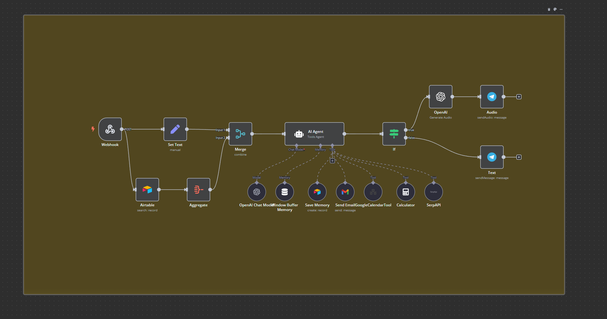
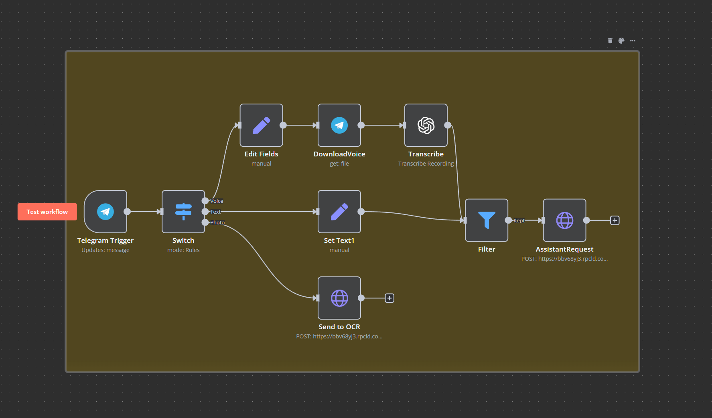
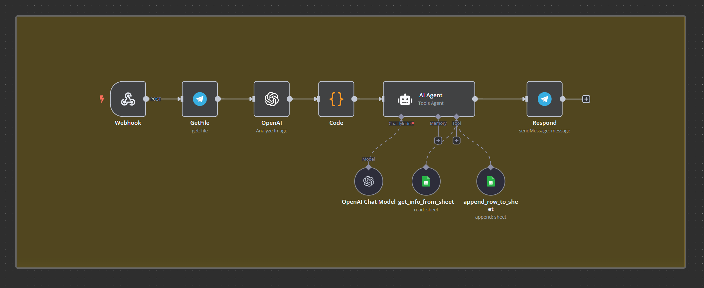
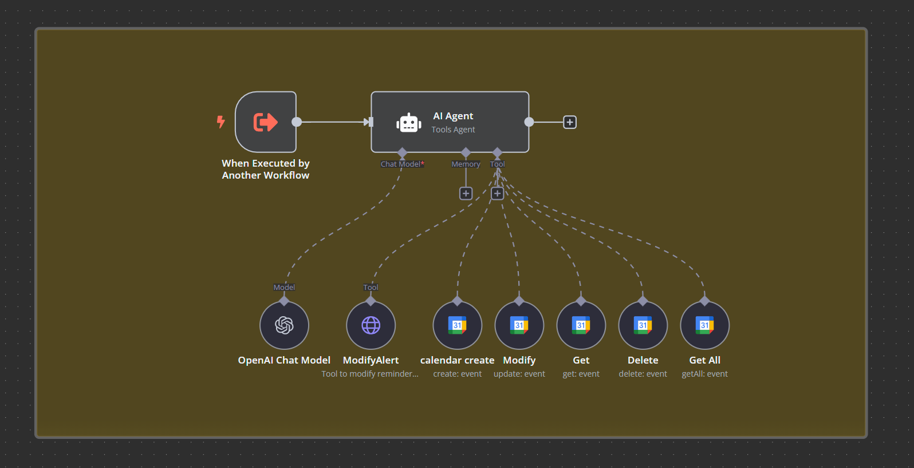

# AI-Powered Personal Assistant Workflow

This repository contains a set of n8n workflows that together form a powerful, AI-driven personal assistant integrated with Telegram. The assistant is designed to streamline various tasks, from handling user queries and managing calendar events to processing screenshots of body measurements and providing quick email communication.

 **Disclaimer:** This project was developed for personal use and may require adjustments to function in other environments. Please carefully review the configuration notes and adapt the workflows to your specific needs.

## Technologies Used

n8n
OpenAI API (for OCR)
Telegram API
Google Sheets
Google Calendar API
Airtable
SerpAPI

## Workflow Architecture

The system is composed of the following main workflows:

### 1. AIAssistant Workflow (AIAssistant.json)

**Role:** This is the central processing unit of the assistant. It receives user requests from the Telegram Workflow, analyzes them, and orchestrates the appropriate tools and services to fulfill the request.
**Functionality:**
* Understands and responds to user queries with a direct, efficient, and slightly ironic tone.
* Manages long-term memory about the user using Airtable.
* Provides access to various tools:
    * Send Email: Enables sending emails directly from the Telegram chat.
    * SerpAPI: Performs internet searches.
    * GoogleCalendarTool: Manages Google Calendar events and reminders.
    * Calculator: Performs mathematical calculations.
**Input:** Text messages from the Telegram Workflow.
**Output:** Text or voice messages sent back to the Telegram Workflow.

### 2. Telegram Workflow (Telegram.json)

 **Role:** Handles communication with the user via Telegram.
**Functionality:**
* Listens for new messages (text, voice, or images) sent to the Telegram bot.
    * Text/Voice Messages: Forwards text and transcribed voice messages to the AIAssistant Workflow for processing.
    * Image Messages: Sends images to the OCR Workflow for analysis.
* Sends the AI assistant's responses (text or voice) back to the user on Telegram.
**Input:** User messages (text, voice, or images) from Telegram.
**Output:** Messages (text or voice) sent to the user via Telegram.

### 3. OCR Workflow (OCR.json)

 **Role:** Processes images sent by the user to extract information.
**Functionality:**
* Receives images from the Telegram Workflow.
* Uses the OpenAI API for OCR to extract text from the images.
**Image Analysis:**
* Determines if the image contains body measurements (e.g., a screenshot from an Excel sheet).
* If it's a measurement image, extracts the data into a JSON format suitable for processing and storage in Google Sheets.
* If it's another type of image, generates a brief textual description.
**Input:** Images from the Telegram Workflow.
**Output:**
* Updates the Google sheet and sends a confirmation message to Telegram.
* Textual description of the image, sent to Telegram.

### 4. Google Calendar Tool Workflow (GoogleCalendarTool.json)

 **Role:** Acts as an intelligent agent specifically for managing Google Calendar based on natural language input from the AIAssistant Workflow.
**Functionality:**
* Receives user requests related to calendar management from the AIAssistant Workflow.
* Uses a smart prompt to understand the user's intent (e.g., scheduling, viewing, modifying events).
* Orchestrates the following Google Calendar tools based on the user's request:
    * Create: Schedule appointments or personal notes.
    * Get: Retrieve details of a specific event.
    * Get All: Search events within a time range.
    * Modify: Update or reschedule an existing event.
    * Delete: Cancel appointments or personal notes.
    * ModifyAlert: Change the alert (notification) time of an existing event.
* Adheres to specific rules for scheduling (working hours, buffer time, default alerts).
* Responds with clear confirmations or explanations based on the calendar actions.
**Input:** Natural language queries about the calendar from the AIAssistant Workflow.
**Output:** Information about the calendar events or confirmation of actions taken, sent back to the AIAssistant Workflow for delivery to the user.

## Installation

1.  **Install n8n:** Ensure you have a working installation of n8n.
2.  **Import Workflows:** Import the following JSON files into your n8n instance:
    * AIAssistant.json
    * Telegram.json
    * OCR.json
    * GoogleCalendarTool.json
3.  **Configure Credentials:** For each service used in the workflows, you will need to set up the necessary credentials in your n8n instance. This includes:
    * Telegram API key
    * OpenAI API key
    * Google Sheets API credentials (and Spreadsheet ID - see "Google Sheets Integration" below)
    * Google Calendar API credentials
    * Airtable API key and base ID
    * SerpAPI key
    * Credentials for your specific OCR service

## Basic Usage

Once the workflows are set up and the credentials are configured, you can interact with the AI assistant through your Telegram bot.
**Examples:**
* General Queries: "What's the weather like today?"
* Calendar Management: "Add a meeting to my calendar for tomorrow at 2 PM with John."
* Reminders: "Remind me in 10 minutes to take out the trash."
* Email: "Send an email to john.doe@example.com saying 'Meeting rescheduled to Monday'."
* Image Processing: Send a screenshot from your AppSheet application containing body measurements. The assistant will extract the data and store it. You can also send other types of images, and the assistant will attempt to describe them.

## Important Considerations / Configuration Notes

* **Google Sheets Integration:**
    * The OCR Workflow interacts with Google Sheets to store measurement data.
    * You **must** create your own Google Sheet to store this data.
    * You **must** reconfigure the Google Sheets nodes in the OCR Workflow with your own Google Sheets credentials and the correct Spreadsheet ID and Sheet Name.
    * Refer to the official n8n documentation for instructions on setting up Google Sheets credentials.
* **OCR Service:**
    * This workflow uses the OpenAI API for OCR. You may need to adjust the OpenAI node in the OCR Workflow depending on your specific prompt and configuration.
* **Custom HTTP Request Node:**
    * The Google Calendar Tool Workflow includes a custom HTTP Request node specifically designed to modify event reminders. This may require adjustments depending on your Google Calendar API setup.
* **AIAssistant Workflow Name:**
    * You may want to consider renaming the "AIAssistant Workflow" to something even more descriptive if it better suits your needs.

## Contributing

Contributions to improve these workflows are welcome! Please feel free to submit pull requests or open issues.

## License

MIT License
